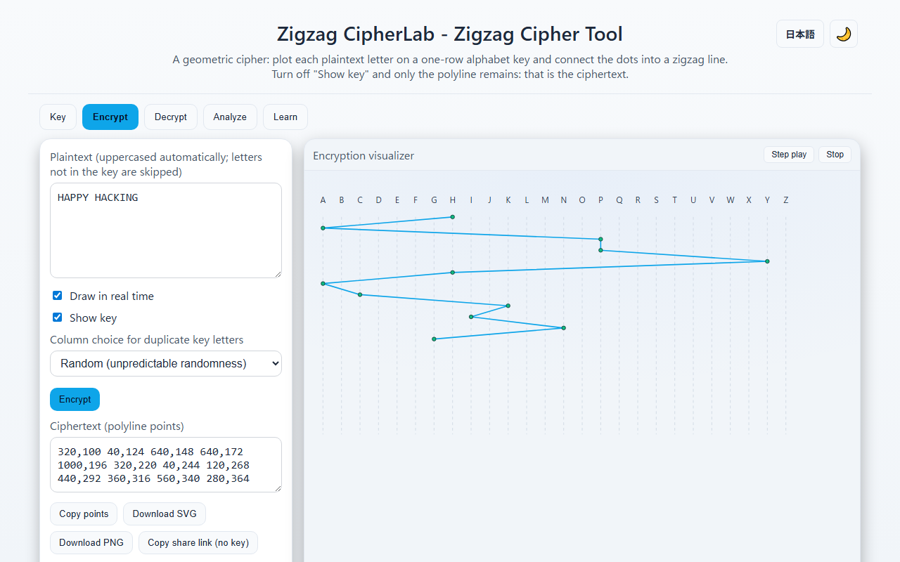
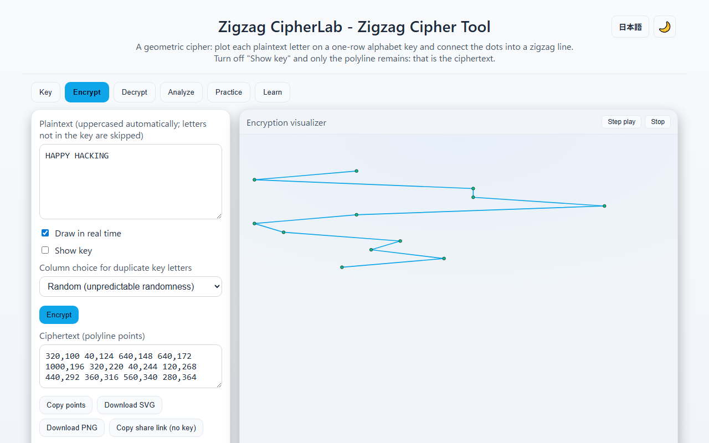
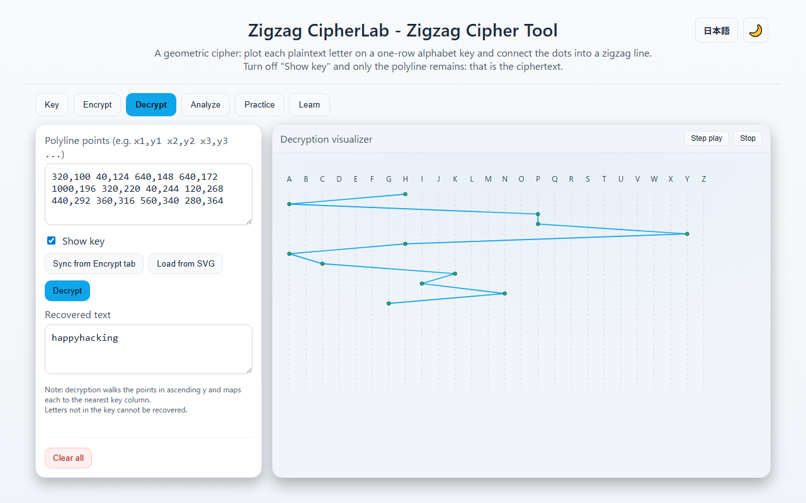
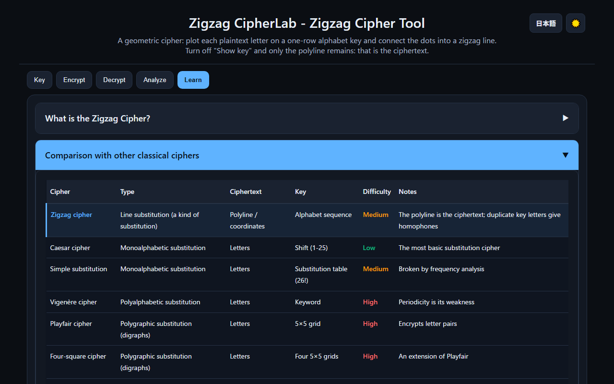
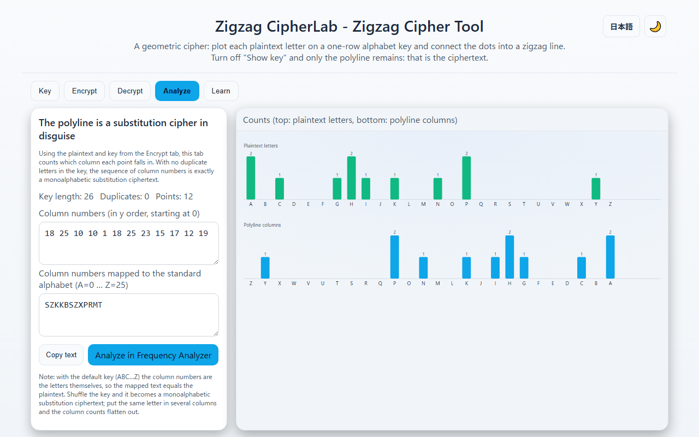

English · [日本語](README.md)

# Zigzag CipherLab - Zigzag Cipher Tool


[](https://ipusiron.github.io/zigzag-cipherlab/)

**Day072 - 100 Security Tools with Generative AI**

**Zigzag CipherLab** lets you experience a geometric cipher that turns letters into dots and lines.
Using an alphabet sequence as the key, the plaintext becomes a polyline that looks like nothing but a zigzag pattern to a third party.

It is designed for education and research, so that the history and the mechanism can be learned intuitively. The interface switches between Japanese and English.

---

## 🌐 Demo

👉 **[https://ipusiron.github.io/zigzag-cipherlab/](https://ipusiron.github.io/zigzag-cipherlab/)**

Try it directly in your browser.

---

## 📸 Screenshots

>
>*Encrypt tab. The plaintext HAPPY HACKING becomes a polyline on the default key (ABC…Z), and the ciphertext (polyline points) is shown*

>
>*With "Show key" off, the key letters and guide lines disappear and only the polyline remains. The SVG, PNG and share link exported in this state contain no key*

>
>*Decrypt tab. The points synced from the Encrypt tab are walked in y order and mapped back to the nearest key column*

>
>*Learn tab (dark mode). Classification into line substitution, substitution and transposition, and the properties of the Zigzag Cipher*

>
>*Analyze tab. With the key reversed (ZYX…A), the column numbers mapped to the standard alphabet become an Atbash ciphertext. The polyline is a substitution cipher in disguise*

---

## 🔐 What is the Zigzag Cipher?

The **Zigzag Cipher** is a geometric cipher that represents letters as dots and lines.
Using a key, a strip of paper with the alphabet written in one row, you put a dot at the position of each plaintext letter and connect neighbouring dots with a line. The resulting polyline (a zigzag pattern) is the ciphertext.
Remove the key and a third party sees nothing but a zigzag line.

- Classification: said to fall under the "line substitution" category (lines standing in for letters) in Edogawa Rampo's essay on kinds of cipher notation (Japanese-language essay)
- Mechanically it is a kind of substitution cipher. With no duplicate letters in the key, the same plaintext letter always lands in the same column, which is exactly a monoalphabetic substitution cipher. Put the same letter in several key columns and that letter scatters over several columns: homophonic substitution
- Origin: Aeneas Tacticus (4th century BC) describes in chapter 31 of his *Poliorcetica* a die bored with 24 holes through which a thread is passed from letter to letter. A thread connecting letter positions in order is the same idea as this cipher. Some accounts attribute the invention to Charles I
- Key freedom: any alphabet sequence works (permuted, irregular, with gaps or duplicates). With the default ABC…Z order, however, a column position is simply the letter itself, so there is no secret
- Layout: a vertical key and a horizontal key work the same way
- A note on the name: in English, "zigzag cipher" usually means the rail fence cipher (a transposition). This tool implements a different cipher, a kind of substitution

### Comparison with other classical ciphers

| Cipher | Type | Ciphertext | Key | Difficulty | Notes |
|---------|------|------------|-----|-----------|------|
| **Zigzag cipher** | Line substitution (a kind of substitution) | Polyline / coordinates | Alphabet sequence | Medium | The polyline is the ciphertext; duplicate key letters give homophones |
| Caesar cipher | Monoalphabetic substitution | Letters | Shift (1-25) | Low | The most basic substitution cipher |
| Simple substitution | Monoalphabetic substitution | Letters | Substitution table (26!) | Medium | Broken by frequency analysis |
| Vigenère cipher | Polyalphabetic substitution | Letters | Keyword | High | Periodicity is its weakness |
| Playfair cipher | Polygraphic substitution (digraphs) | Letters | 5×5 grid | High | Encrypts letter pairs |
| Four-square cipher | Polygraphic substitution (digraphs) | Letters | Four 5×5 grids | High | An extension of Playfair |
| Rail fence cipher | Transposition | Letters | Number of rails | Low | Transposition by zigzag layout |
| Columnar transposition | Transposition | Letters | Column order | Medium | Write in a rectangle, read out columns in key order |

The properties of the Zigzag Cipher are as follows.

- One of the few ciphers whose ciphertext is a figure (a polyline, coordinates) rather than letters. Unlike the Dancing Men or Pigpen ciphers, which replace letters with symbols, the connections of the line itself carry the information
- With no duplicate letters in the key, the sequence of columns the points fall in (the column numbers) is exactly a monoalphabetic substitution ciphertext. The same letter always lands in the same column, so frequency analysis applies directly
- Putting the same letter in several key columns gives homophonic substitution, which flattens frequencies and makes cryptanalysis harder. It is a different mechanism from polyalphabetic ciphers, whose table changes with the period
- The key (the order of letters) must stay secret. Hand over only the polyline with the key letters and guide lines hidden and it is a ciphertext

---

## ✨ Features

- Key: any alphabet sequence (duplicates and gaps allowed, up to 1,000 letters). Apply, Shuffle (unpredictable randomness) and Reset. Length, number of duplicates, number of missing letters and the list of missing letters
- Encrypt: the polyline is drawn in real time as you type. "Encrypt" outputs the ciphertext (polyline points) as text. The tool reports how many letters not in the key and non-letters were skipped, and whether the text was cut at the limit
- Column choice for duplicate key letters: random (unpredictable randomness) / cycle (each repeat of a letter moves to its next column) / first column (ignore duplicates)
- Show key on/off: with it off, the key letters and guide lines disappear and only the polyline remains. The SVG, PNG and share link exported in this state contain no key
- Step play: animate encryption and decryption one letter at a time. For long texts the box follows the current point
- Decrypt: enter the polyline points (or sync them from the Encrypt tab) and they are walked in y order and mapped back to the nearest key column. Invalid formats, negative coordinates and limit violations are reported with their position. Points can also be loaded from an exported SVG or a share link
- Analyze: count which column each point falls in, show the sequence of column numbers and the same sequence mapped to the standard alphabet. Bar charts compare the counts of plaintext letters with the counts of polyline columns, and the mapped text can be sent to Frequency Analyzer (Day009)
- Export: copy the points, download SVG or PNG (with or without the key), copy a share link that contains no key
- Long keys and long texts: the figure grows in width with the key and in height with the text and scrolls inside its box. It is not squeezed, so the letters stay the same size
- Learn: classification, origin and properties of the Zigzag Cipher, and a comparison table of classical ciphers
- Japanese/English switch (`?lang=en` or the header button; the choice is saved), dark/light theme, keyboard tab navigation (arrows, Home, End)

---

## 📖 Usage

1. In the Key tab, set an alphabet sequence (e.g. `DBMRCZESOTH...`; duplicates and gaps are fine). "Shuffle" makes a random order
2. In the Encrypt tab, type the plaintext and the zigzag polyline is drawn in real time. When the key has duplicate letters, choose how the column is picked under "Column choice for duplicate key letters"
3. Press "Encrypt" to get the ciphertext (polyline points) as text. Turn "Show key" off and press "Download SVG" or "Download PNG" to hand over an image of the polyline alone as the ciphertext. "Copy share link (no key)" copies a URL that carries only the points
4. In the Decrypt tab, press "Sync from Encrypt tab", type the points by hand, or press "Load from SVG" to pick an exported SVG. Opening a share link starts the tool with the points already in the Decrypt tab
5. Press "Decrypt" to decrypt at once, or "Step play" to walk the points one by one
6. The recovered text is shown in lowercase (the classical convention)
7. In the Analyze tab, confirm that the polyline is a substitution cipher in disguise. Send the mapped text to "Analyze in Frequency Analyzer" to analyze it as a monoalphabetic substitution cipher

### Example: encrypting HELLOWORLD with the default key

With the key `ABCDEFGHIJKLMNOPQRSTUVWXYZ`, the polyline points for the plaintext `HELLOWORLD` are:

`320,100 200,124 480,148 480,172 600,196 920,220 600,244 720,268 480,292 160,316`

| Letter | Column | Point (x,y) |
|---|---|---|
| H | 7 | 320,100 |
| E | 4 | 200,124 |
| L | 11 | 480,148 |
| L | 11 | 480,172 |
| O | 14 | 600,196 |
| W | 22 | 920,220 |
| O | 14 | 600,244 |
| R | 17 | 720,268 |
| L | 11 | 480,292 |
| D | 3 | 160,316 |

Enter these points in the Decrypt tab and press "Decrypt" to get `helloworld` back. Column numbers start at 0, and with the default key the column number is simply the letter's position in the alphabet, so this key keeps no secret. Reverse the key to `ZYXWVUTSRQPONMLKJIHGFEDCBA` and the "column numbers mapped to the standard alphabet" in the Analyze tab becomes `SVOOLDLIOW`, an Atbash ciphertext.

---

## 🔬 Technical details

### Point coordinates

- Column: `x = 40 + 40 × column` (the column is the position in the key, starting at 0)
- Row: `y = 100 + 24 × row` (the row is the position in the plaintext counting only letters that exist in the key, starting at 0)
- The figure's width follows the key length, `40 + 40 × (key length − 1) + 40` (minimum 1200), and its height follows the number of rows

### Encryption rules

- Only ASCII letters are uppercased and used. Letters missing from the key and non-letters (symbols, digits, accented letters and so on) are skipped and the number of skipped characters is reported
- When the key has duplicate letters, the column is chosen in one of three ways. "Random" uses unpredictable randomness from `crypto.getRandomValues` (two bytes limited to a multiple of the number of candidates, so there is no bias). "Cycle" moves to the next candidate each time the same letter appears (the homophonic convention of using the symbols in turn). "First column" ignores the duplicates
- The chosen column is remembered per plaintext position, so redrawing the same plaintext gives the same polyline. Only positions whose remembered column no longer holds the right letter after a key change are chosen again. Changing the choice method clears the memory
- Step play shows the same points as the normal drawing, one by one (no separate random draw)

### Decryption rules

- Sort the points by ascending y (equal y keeps the input order)
- Read the letter of the column nearest to each point's x. If a point is exactly halfway between two columns, the nearer-to-the-left (lower-numbered) column wins
- The result is lowercase. Nothing is decrypted while the key is empty

### Analysis (a substitution cipher in disguise)

- Column numbers: the points sorted by y, each replaced by the number of its nearest column. With no duplicate letters in the key this is exactly a monoalphabetic substitution ciphertext
- Mapped text: column i mapped to the i-th letter of the standard alphabet (A=0 … Z=25). Keys longer than 26 columns cannot be mapped, so use the column numbers instead
- Bar charts: the top row counts plaintext letters by their position in the standard alphabet, the bottom row counts polyline points by key column. With duplicate key letters the same letter spreads over several columns, so the bottom row flattens
- Frequency Analyzer (Day009) receives the mapped text through `#text=`. Nothing after `#` is sent to the server, and the receiver accepts up to 5,000 characters (this tool's limit is 1,000)

### Handing over a ciphertext without the key

- SVG and PNG: separately from the on-screen figure, the core builds a standalone SVG document. With "Show key" on it includes the key letters and guide lines; with it off it includes only the polyline and points (no key hidden with `display:none`). The PNG is made by drawing that SVG as a `data:` URL image onto a canvas with a white background (scaled down to at most 16,000 px per side and 100 million px in area)
- File names: `zigzag-cipher-with-key.svg` / `.png` with the key, `zigzag-cipher.svg` / `.png` without it
- Share link: the points (URL-encoded) are placed in `#points=`. Nothing after `#` is sent to the server, and the key is never included. The recipient's tool starts with the points in the Decrypt tab and removes `#points=` from the URL after loading
- Loading from SVG: the `points` attribute of the first `<polyline>` in the file is read. Even if an SVG with the key is chosen, only the polyline is read

### Limits

| Item | Limit | Notes |
|---|---|---|
| Key length | 1,000 letters | Non-letters are removed before counting |
| Plaintext length | 1,000 letters | Counting only letters that exist in the key; the rest is cut and reported |
| Number of polyline points | 1,000 points | Equal to the encryption limit, so every ciphertext made by this tool can be decrypted |
| Polyline points input | 50,000 characters | Length of the whole text |

### Japanese and English

- The initial language is decided by `?lang=ja|en`, then the saved choice, then the browser language (anything other than Japanese gives English). The header button switches languages and the choice is saved in localStorage (the tool also works where localStorage is unavailable)
- The interface strings live in the dictionary in `js/messages.js` with the same keys for both languages. Static text is marked with `data-i18n`, dynamic notices go through `t()`. `<html lang>` and `<title>` switch too

### Structure

- `js/zz-core.js`: the computation core, pure functions without the DOM (key normalization and statistics, point coordinates, plaintext preparation, column choice, point parsing and formatting, nearest column, decryption, shuffle, column numbers and mapping, share link, SVG document and reading it back). The random source is injected
- `js/messages.js`: interface strings (Japanese and English). `js/i18n.js`: language selection and static text replacement
- `script.js`: the interface (drawing, events, theme, language)
- The figure is drawn at its natural size (1 unit = 1 px) and scaled down to the box width when wider, but not below 0.55; the rest scrolls inside the box

---

## 🎯 Use cases

- Learning security: confirm in the Analyze tab that the polyline ciphertext is a substitution cipher in disguise by turning it back into column numbers. Send the mapped text to Frequency Analyzer and go all the way to reading it by frequency analysis without the key. See how duplicate key letters (homophones) flatten the frequencies, and that none of it matters unless the key stays secret
- Information and mathematics classes or self-study: understand that "a ciphertext need not be letters" and "the same information can live in dots and lines" hands-on, together with the coordinate formula (`x = 40 + 40 × column`). The "nearest column" rule of decryption is an entry point to quantization and nearest-neighbour ideas
- Research into cipher history: try out Rampo's category (line substitution) and the same idea as Aeneas' threaded die by actually drawing the figure. Produce figures (PNGs of polyline ciphertexts) for fanzines and talks
- Puzzle events, escape rooms and ARGs: hand out the polyline alone as SVG or PNG with the key hidden, or a share link (no key), and let participants guess the key. Deliver the key order through another clue to build a multi-stage puzzle
- Letters and treasure hunts for children: turn a treasure map of the house or a birthday message into a polyline and hand it over together with the key strip
- Design and creative work: use the polyline itself as a pattern. Make a "zigzag line with meaning" as a prop in a novel or comic
- Combining with other tools: a polyline made with a key without duplicates is a monoalphabetic substitution cipher, so it can be analyzed in Frequency Analyzer (Day009) from the Analyze tab. Compare it with the rail fence cipher, which shares the name in English (RailFence CipherLab, Day034), to see the difference between transposition and substitution
- Sharing with readers abroad: with the English interface and this English README, the tool is material for introducing Japanese cipher history (Rampo's classification) to English-speaking readers
- Limits: this is a classical cipher and cannot protect real secrets. Once the key order leaks, the polyline reads as plaintext

---

## 🔒 Security

- Runs entirely in the browser and sends nothing out (CSP `connect-src 'none'`, no external scripts or styles). The Frequency Analyzer link opens in a new tab and passes only the mapped text, never the key
- The CSP is `default-src 'self'` based and allows no inline scripts or styles. `base-uri 'none'`, `form-action 'none'`, referrer `no-referrer`
- Only the theme and language choices are stored (localStorage). The tool works where localStorage is unavailable
- The random column choice and the shuffle use `crypto.getRandomValues` (never `Math.random`)
- Output goes through `textContent` and `createElementNS`; no variables are put into `innerHTML`. A loaded SVG is not parsed as a document: only the `points` attribute string is extracted with a regular expression
- Input limits (key 1,000 letters, plaintext 1,000 letters, 1,000 points, 50,000 input characters) keep the processing bounded
- SVG, PNG and share links exported with the key hidden contain no key

---

## ⚠️ Notes

- This is for learning classical ciphers and is not suitable for protecting real secrets
- With the default key (ABC…Z) the column position is simply the letter, so there is no encryption. Use a secret order as the key
- An SVG or PNG downloaded with "Show key" on contains the key letters. Turn it off before downloading when handing over a ciphertext
- The share link carries no key, but the points go in as they are. Long texts make long URLs (about 12,000 characters for 1,000 points), so the link is unsuitable for services that shorten URLs or for QR codes
- The point coordinates depend on this tool's figure constants (column spacing 40, row spacing 24). The recipient should decrypt with the same tool
- Letters not in the key and non-letters are not part of the ciphertext (the number skipped is shown on screen). The recipient cannot recover the original symbols or spaces
- In English, "zigzag cipher" usually means the rail fence cipher, which is a different cipher from the one in this tool

---

## 🔗 References and related tools

- Aeneas Tacticus, *Poliorcetica*, chapter 31 on secret messages (English translation): <https://aeneastacticus.net/public_html/ab31.htm> (a die bored with 24 holes and a thread passed through them)
- Kotsanas Museum of Ancient Greek Technology, "Aeneas' cryptographic disc": <https://kotsanas.com/en/aeneas-cryptographic-disc-4th-c-b-c>
- Edogawa Rampo, essay on kinds of cipher notation, in his collection *Zoku Gen'eijō* (Japanese-language book)
- Related tools (100 Security Tools with Generative AI)
  - Frequency Analyzer (Day009): <https://ipusiron.github.io/frequency-analyzer/> frequency analysis of the mapped text sent from the Analyze tab
  - DancingMen CipherLab (Day022): <https://ipusiron.github.io/dancingmen-cipherlab/> a figure cipher made of symbols
  - Playfair CipherLab (Day027): <https://ipusiron.github.io/playfair-cipherlab/> digraph substitution
  - Pigpen CipherLab (Day032): <https://ipusiron.github.io/pigpen-cipherlab/> a figure cipher made of symbols
  - RailFence CipherLab (Day034): <https://ipusiron.github.io/railfence-cipherlab/> the transposition cipher also called the zigzag cipher in English
  - Columnar CipherLab (Day043): <https://ipusiron.github.io/columnar-cipherlab/> columnar transposition

---

## 📁 Directory structure

```
zigzag-cipherlab/
├── .github/                # GitHub settings
│   └── workflows/          # GitHub Actions workflows
│       └── test.yml        # Runs npm test on push and pull_request
├── assets/                 # Images for the README (Japanese interface)
│   ├── en/                 # Images of the English interface (for README.en.md)
│   │   ├── screenshot.png  # Encrypt tab
│   │   ├── screenshot2.png # Polyline with the key hidden
│   │   ├── screenshot3.png # Decrypt tab
│   │   ├── screenshot4.png # Learn tab (dark)
│   │   └── screenshot5.png # Analyze tab
│   ├── screenshot.png      # Encrypt tab (HAPPY HACKING, key shown)
│   ├── screenshot2.png     # Polyline alone with the key hidden
│   ├── screenshot3.png     # Decrypt tab
│   ├── screenshot4.png     # Comparison table in the Learn tab (dark mode)
│   └── screenshot5.png     # Analyze tab (Atbash with a reversed key)
├── js/                     # Scripts loaded by the page
│   ├── zz-core.js          # Computation core (no DOM: encryption, decryption, points, SVG document, analysis)
│   ├── zz-practice.js      # Practice core (same quiz for each number, answer check, hints)
│   ├── messages.js         # Interface strings (Japanese and English)
│   └── i18n.js             # Language selection and static text replacement
├── test/                   # Automated tests (node --test)
│   ├── load.js             # Helper that loads js/*.js into the tests
│   ├── core.test.js        # Core tests (known answers, round trips, limits, randomness, SVG, analysis, share link)
│   ├── practice.test.js    # Practice tests (determinism, round trip, answer check, hints)
│   ├── html.test.js        # Static checks of index.html (CSP, aria, script order)
│   ├── contrast.test.js    # Color contrast (dark and light)
│   ├── format.test.js      # Line length, line count, where strings live
│   ├── i18n.test.js        # Dictionary keys and the strings on the page
│   └── readme.test.js      # README examples, tables, images, tree and wording (both languages)
├── index.html              # The page (Key, Encrypt, Decrypt, Analyze and Learn tabs)
├── script.js               # Interface logic (drawing, events, theme, language)
├── style.css               # Styles (dark and light themes, responsive)
├── package.json            # npm test (node --test, no dependencies)
├── CLAUDE.md               # Development guide for Claude Code
├── README.md               # Japanese README
├── README.en.md            # This document
├── LICENSE                 # MIT License
├── .gitignore              # Git ignore rules
└── .nojekyll               # GitHub Pages (no Jekyll)
```

---

## 🧪 Tests

```bash
npm test
```

- Node.js 22 or later. No dependencies (`node --test`)
- Run automatically by GitHub Actions on every push and pull request
- What is verified: the known answer with the default key (HELLOWORLD), Atbash with a reversed key (SVOOLDLIOW), 200 round trips with random keys and plaintexts, the limits (1,000 for key, plaintext and points), the column choice for duplicate key letters and the per-position memory, bias-free randomness, error detection when parsing points, that an SVG exported with the key hidden contains no key, the share link round trip, reading an SVG back, CSP and aria in index.html, color contrast, the dictionary keys and the strings on the page, and the examples, tables, images and directory tree of both READMEs

---

## 💻 Requirements

- A modern browser (latest Chrome, Edge, Firefox or Safari)
- No build step. Open `index.html` directly (`file://`) or serve it with any static server
- The English interface is `index.html?lang=en`, or use the header button

```bash
python -m http.server 8000
```

---

## 📄 License

MIT License – see [LICENSE](LICENSE) for details.

---

## 🛠️ About this tool

This tool was developed as part of the "100 Security Tools with Generative AI" project.
In this project, a variety of security-related tools are created and published over 100 days with the help of AI.

For details of the project and the other tools, see the page below.

🔗 [https://akademeia.info/?page_id=42163](https://akademeia.info/?page_id=42163)
