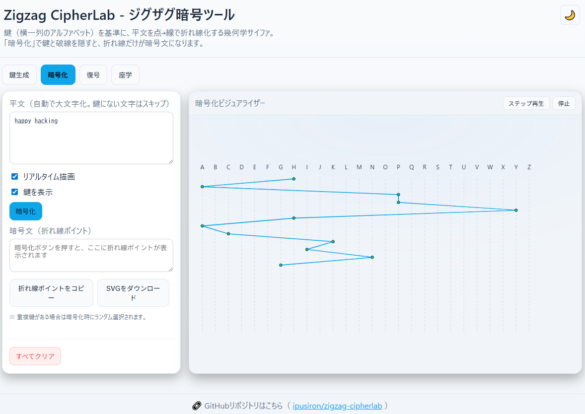

<!--
---
title: Zigzag CipherLab
category: classical-cryptography
difficulty: 1
description: A geometrical cipher where plaintext letters are plotted as points along an alphabet key and connected into a zigzag polyline. Without the key, the figure looks like meaningless lines.
tags: [zigzag-cipher, geometrical, classical-crypto, visualization, education, javascript]
demo: https://ipusiron.github.io/zigzag-cipherlab/
---
-->

# Zigzag CipherLab - ジグザグ暗号ツール


[](https://ipusiron.github.io/zigzag-cipherlab/)

**Day072 - 生成AIで作るセキュリティツール100**

**Zigzag CipherLab**では、文字を点と線に変換して暗号文を生成する、幾何学的な暗号手法を体験できます。
鍵となるアルファベットの配列を使って平文を折れ線に変換し、第三者には単なるジグザグ模様にしか見えない暗号を作り出します。

教育・研究用途として、歴史的背景や仕組みを直感的に学べるよう設計されたツールです。

---

## 🌐 デモページ

👉 **[https://ipusiron.github.io/zigzag-cipherlab/](https://ipusiron.github.io/zigzag-cipherlab/)**

ブラウザーで直接お試しいただけます。

---

## 📸 スクリーンショット

>  
>*平文"happy hacking"を暗号化する*

---

## 🔐 ジグザグ暗号とは

**ジグザグ暗号（Zigzag Cipher）** は、文字を点と線で表現する **幾何学サイファ** の一種です。  
鍵となる「アルファベットの紙」を用い、平文文字の位置に点を打ち、隣接する点を線で結んでいくと、折れ線（ジグザグ模様）が暗号文となります。  
鍵を外すと、第三者には単なるジグザグ線にしか見えないのが特徴です。

- **分類**：
  - 江戸川乱歩『暗号記法の種類』によると「線代用法」に属する
  - 鍵に重複文字が存在しない場合は、「同じ平文文字が同じ折れ線ポイントに暗号化される」ので、単一換字式暗号。ただし、鍵の重複文字を許可するので、その際はその文字だけは多表式になる（特殊）。
- **起源**：チャールズ1世が発明したとされるが、古代ギリシアのアイネイアスの著作にも類似があり、実際の起源は不明  
- **鍵の自由度**：アルファベット配列は任意（順列・不規則・欠落・重複すべて可）  
- **配置**：縦配置・横配置いずれでも原理的には同じ

### 他の古典暗号との比較

| 暗号方式 | 分類 | 暗号文形式 | 鍵 | 解読難易度 | 特徴 |
|---------|------|------------|-----|-----------|------|
| **ジグザグ暗号** | 線代用法 | 折れ線・座標 | アルファベット配列 | 中 | 視覚的暗号、重複鍵対応 |
| シーザー暗号 | 単一換字式 | アルファベット | シフト数(1-25) | 低 | もっとも基本的な換字暗号 |
| 単一換字暗号 | 単一換字式 | アルファベット | 置換表(26!) | 中 | 頻度分析で解読可能 |
| ヴィジュネル暗号 | 多表式 | アルファベット | キーワード | 高 | 周期性が弱点 |
| プレイフェア暗号 | 多表式 | アルファベット | 5×5格子 | 高 | 2文字組での暗号化 |
| 四方暗号 | 多表式 | アルファベット | 4つの5×5格子 | 高 | プレイフェアの拡張 |
| レールフェンス暗号 | 転置式 | アルファベット | レール数 | 低 | ジグザグ配置での転置 |
| 棚暗号 | 転置式 | アルファベット | 列順序 | 中 | 矩形配置での転置 |

**ジグザグ暗号の独自性**：
- 唯一の「図形暗号」として、文字ではなく座標・線分が暗号文
- 視覚的暗号として、数学的解読よりも幾何学的復元が必要
- 重複鍵により、単一換字と多表式の特性を併せ持つ

---

## 🛠️ ツール仕様

### 画面構成（4タブ）
1. **鍵生成**
   - 任意のアルファベット配列を定義
   - ボタン：**適用 / シャッフル / リセット**
   - 重複・欠落を許容し、自由な鍵を作成可能
   - 統計表示：鍵の長さ、重複数、欠落文字数

2. **暗号化**
   - 平文を入力すると、鍵上の位置に点を打ち、下へ1段ずつ進みながら折れ線をリアルタイム描画
   - トグル：**リアルタイム描画ON/OFF** / **鍵表示ON/OFF**
   - ボタン：**暗号化** / **すべてクリア**
   - 「暗号化」押下後、暗号文（折れ線ポイント）をテキスト形式で表示
   - エクスポート：**折れ線ポイントをコピー** / **SVGダウンロード**
   - ビジュアライザー内：**ステップ再生** / **停止**

3. **復号**
   - 折れ線ポイント入力欄でリアルタイム描画・エラー検証
   - トグル：**鍵表示ON/OFF**
   - ボタン：**暗号化タブから同期** / **復号** / **すべてクリア**
   - 復号結果を小文字で出力（古典暗号の慣例）
   - ビジュアライザー内：**ステップ再生** / **停止**

4. **座学**
   - ジグザグ暗号の概念、歴史的背景（線代用法、チャールズ1世、アイネイアス）を解説  

---

## 📋 設計仕様（詳細）

### 鍵
- アルファベット配列は自由に設定可能  
- 重複・欠落を含んでもよい  
- 鍵の配列は縦でも横でも構わず、原理は同じ  

### プロット規則
- 入力文字ごとに、対応する列の位置に点を打つ
- 横方向に進むごとに縦位置を1段下げる
- 各点を直線で結び、折れ線を構成
- 鍵に存在しない文字はスキップ
- 重複鍵がある場合、各文字位置で一度選択した列を固定（同じ平文でも毎回異なる暗号文を防ぐ）

### 表示モード・UI機能
- **鍵表示ON/OFF**：鍵と破線ガイドの表示切替
- **リアルタイム描画**：入力に合わせて即座に折れ線を描画
- **ステップ再生**：暗号化・復号プロセスを1文字ずつアニメーション
- **自動スクロール**：長い平文で画面外に出た場合の自動調整
- **テーマ切替**：ダークモード・ライトモードの切替

### 例外処理・エラーハンドリング
- 入力が空 → 描画なし
- 入力文字がすべて鍵外 → 折れ線なし
- 鍵が空 → 注意表示
- 復号時の不正ポイント → エラーメッセージで該当箇所を明示
- 範囲外座標 → 座標範囲チェック（x: 0-2000, y: 0-5000）

---

## 💡 使用例
1. 鍵生成タブでアルファベットを設定（例：`DBMRCZESOTH...`）
2. 暗号化タブで平文を入力すると、ジグザグ折れ線がリアルタイムで描かれる
3. 「暗号化」ボタンで暗号文（折れ線ポイント）をテキスト形式で取得
4. 復号タブで「暗号化タブから同期」または手動で折れ線ポイントを入力
5. 「復号」ボタンで即座に復号、または「ステップ再生」でアニメーション復号
6. 復号結果は小文字で表示（古典暗号の慣例）

---

## 👥 対象者

- **暗号史に関心のある読者**  
  古典暗号や江戸川乱歩の「暗号記法の種類」などに触れたい人。  

- **セキュリティ教育の実践者**  
  学生や研修向けに、文字ではなく図形として暗号を体験させたい教育者。  

- **クラシカル暗号愛好家**  
  シーザー暗号やプレイフェア暗号に飽き足らず、新しい暗号手法を探している人。  

- **パズル・図形好きのユーザー**  
  点と線で形成される折れ線暗号を、知的パズルや視覚的遊びとして楽しみたい人。  

- **研究・再現に興味を持つ開発者**  
  歴史的に珍しい暗号方式を可視化し、アルゴリズムや鍵設計を実験したい人。  

---

## 🎯 利用シナリオ

1. **授業・ワークショップでの体験教材**  
   情報セキュリティや暗号史の授業において、学生に「文字が図形になる暗号」を体験させる。  
   文字暗号との違いを直感的に理解するきっかけになる。  

2. **古典暗号研究や同人誌の資料作成**  
   歴史的に珍しい暗号をビジュアル化し、研究発表や同人誌に掲載する図版を生成する。  
   チャールズ1世やアイネイアスとの関連に言及する文脈で活用可能。  

3. **暗号パズルやイベントでの出題**  
   折れ線だけが示された暗号文を提示し、参加者に鍵を推測させる。  
   謎解きイベントやセキュリティ競技の一要素として利用できる。

---

## 📁 ディレクトリー構成

```
zigzag-cipherlab/
├── index.html          # メインのHTMLファイル（SPA）
├── script.js           # JavaScriptロジック（暗号化・復号・UI制御）
├── style.css           # スタイルシート（ダーク・ライトテーマ対応）
├── CLAUDE.md           # Claude Code用の開発ガイド
├── README.md           # プロジェクト説明書
├── LICENSE             # MITライセンス
├── .nojekyll           # GitHub Pages設定
├── .gitignore          # Git除外設定
└── assets/
    └── screenshot.png  # デモ用スクリーンショット
```

---

## 📄 ライセンス

MIT License – 詳細は [LICENSE](LICENSE) を参照してください。

---

## 🛠 このツールについて

本ツールは、「生成AIで作るセキュリティツール100」プロジェクトの一環として開発されました。 
このプロジェクトでは、AIの支援を活用しながら、セキュリティに関連するさまざまなツールを100日間にわたり制作・公開していく取り組みを行っています。

プロジェクトの詳細や他のツールについては、以下のページをご覧ください。  

🔗 [https://akademeia.info/?page_id=42163](https://akademeia.info/?page_id=42163)
