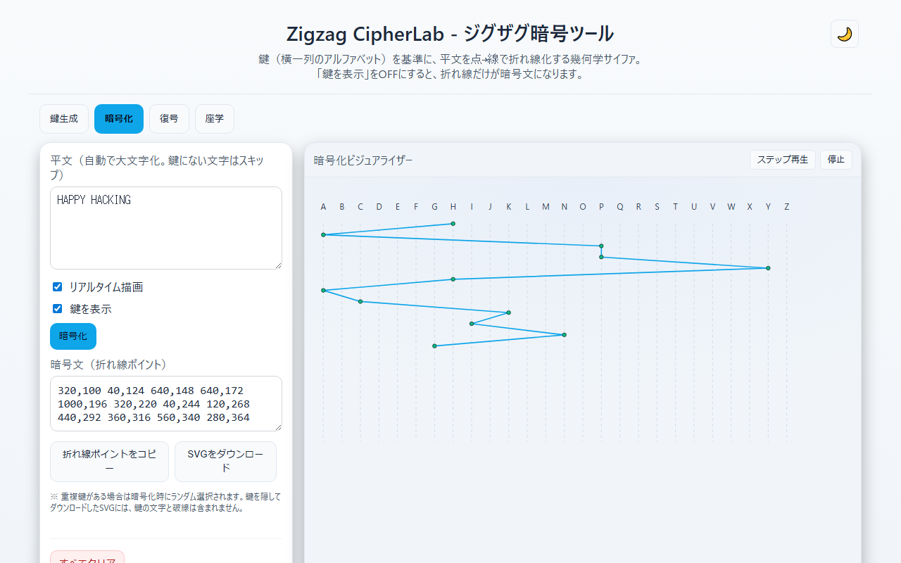
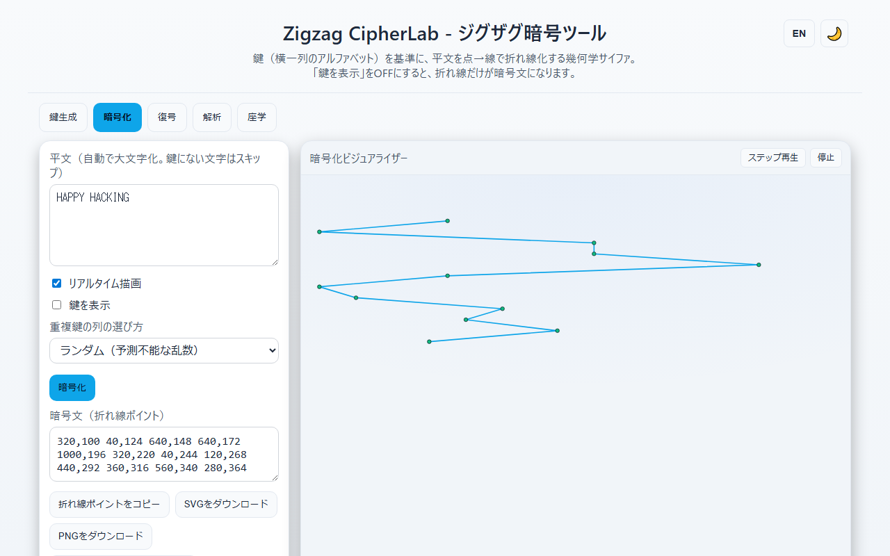
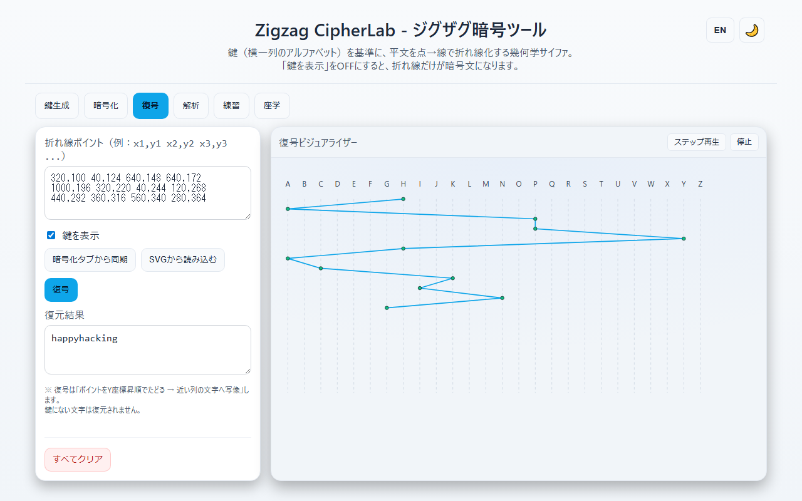
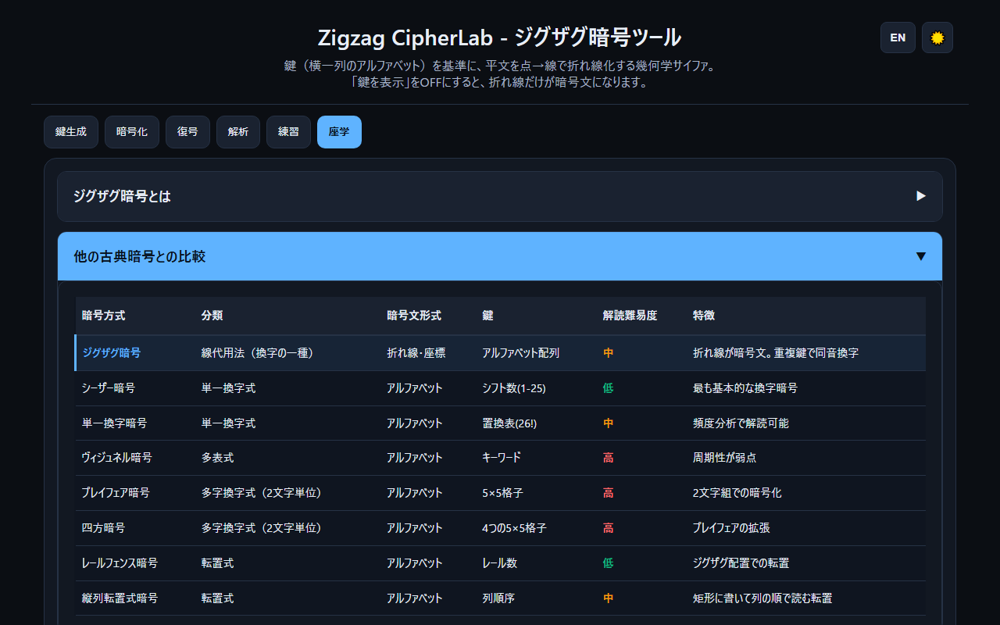

<!--
---
id: day072
slug: zigzag-cipherlab

title: "Zigzag CipherLab"

subtitle_ja: "ジグザグ暗号ツール"
subtitle_en: "Zigzag Cipher Visualization Tool"

description_ja: "文字を点と線に変換して暗号文を生成する幾何学サイファ（ジグザグ暗号）の学習ツール。鍵となるアルファベット配列に沿って平文を折れ線に変換し、暗号化・復号の過程をSVGで体験できます。鍵を含めない折れ線だけのSVG書き出し、重複鍵（同音換字）、長い鍵・平文にも対応。"
description_en: "An educational tool for the Zigzag Cipher, a geometrical cipher where plaintext letters are plotted as points along an alphabet key and connected into a zigzag polyline. Export the polyline alone as the ciphertext (no key inside the SVG), use duplicate letters in the key as homophones, and handle long keys and texts."

category_ja:
  - 古典暗号
category_en:
  - Classical Cryptography

difficulty: 1

tags:
  - zigzag-cipher
  - geometrical-cipher
  - classical-crypto
  - homophonic-substitution
  - visualization
  - education
  - javascript
  - svg

repo_url: "https://github.com/ipusiron/zigzag-cipherlab"
demo_url: "https://ipusiron.github.io/zigzag-cipherlab/"

hub: true
---
-->

# Zigzag CipherLab - ジグザグ暗号ツール


[](https://ipusiron.github.io/zigzag-cipherlab/)

**Day072 - 生成AIで作るセキュリティツール100**

**Zigzag CipherLab**では、文字を点と線に変換して暗号文を生成する、幾何学的な暗号手法を体験できます。
鍵となるアルファベットの配列を使って平文を折れ線に変換し、第三者には単なるジグザグ模様にしか見えない暗号を作り出します。

教育・研究用途として、歴史的背景や仕組みを直感的に学べるよう設計されたツールです。

---

## 🌐 デモページ

👉 **[https://ipusiron.github.io/zigzag-cipherlab/](https://ipusiron.github.io/zigzag-cipherlab/)**

ブラウザーで直接お試しいただけます。

---

## 📸 スクリーンショット

>
>*暗号化タブ。平文 HAPPY HACKING を既定の鍵（ABC…Z）で折れ線にし、暗号文（折れ線ポイント）を出す*

>
>*「鍵を表示」をOFFにすると、鍵の文字と破線が消えて折れ線だけが残る。この状態でダウンロードしたSVGに鍵は含まれない*

>
>*復号タブ。暗号化タブから同期した折れ線ポイントを、y座標の順にたどって最も近い列の文字に戻す*

>
>*座学タブ（ダークモード）。線代用法・換字式・転置式の分類と、ジグザグ暗号の性質*

---

## 🔐 ジグザグ暗号とは

**ジグザグ暗号（Zigzag Cipher）** は、文字を点と線で表現する幾何学サイファの一種です。
鍵となる「アルファベットを一列に並べた紙」を用い、平文の各文字の位置に点を打ち、隣り合う点を線で結んでいくと、折れ線（ジグザグ模様）が暗号文になります。
鍵を外すと、第三者には単なるジグザグ線にしか見えません。

- 分類：江戸川乱歩「暗号記法の種類」でいう「線代用法」（文字の代わりに線で表す方法）に当たるとされる
- 仕組みの上では換字式暗号の一種。鍵に重複文字がなければ「同じ平文の文字が同じ列に置かれる」ので単一換字式暗号と同じ。鍵に同じ文字を複数置くと、その文字は複数の列のどれかに散る同音換字（ホモフォニック）になる
- 起源：古代ギリシアのアイネイアス（紀元前4世紀）は『攻城論』第31章で、24の穴をあけた骰子に糸を通し、文字の穴を順にたどって伝える方法を記している。糸が文字の位置を順に結ぶ点はこの暗号と同じ発想である。チャールズ1世の考案とする説も伝えられる
- 鍵の自由度：アルファベット配列は任意（順列・不規則・欠落・重複すべて可）。ただし既定のABC…Zの並びのままでは、列の位置がそのまま文字を表すので秘密にならない
- 配置：縦配置・横配置いずれでも原理は同じ
- 名前の注意：英語で「zigzag cipher」というと、レールフェンス暗号（転置式）の別名を指すことが多い。本ツールの方式は転置ではなく換字の一種で、別の暗号である

### 他の古典暗号との比較

| 暗号方式 | 分類 | 暗号文形式 | 鍵 | 解読難易度 | 特徴 |
|---------|------|------------|-----|-----------|------|
| **ジグザグ暗号** | 線代用法（換字の一種） | 折れ線・座標 | アルファベット配列 | 中 | 折れ線が暗号文。重複鍵で同音換字 |
| シーザー暗号 | 単一換字式 | アルファベット | シフト数(1-25) | 低 | 最も基本的な換字暗号 |
| 単一換字式暗号 | 単一換字式 | アルファベット | 置換表(26!) | 中 | 頻度分析で解読可能 |
| ヴィジュネル暗号 | 多表式 | アルファベット | キーワード | 高 | 周期性が弱点 |
| プレイフェア暗号 | 多字換字式（2文字単位） | アルファベット | 5×5格子 | 高 | 2文字組での暗号化 |
| 四方暗号 | 多字換字式（2文字単位） | アルファベット | 4つの5×5格子 | 高 | プレイフェアの拡張 |
| レールフェンス暗号 | 転置式 | アルファベット | レール数 | 低 | ジグザグ配置での転置 |
| 縦列転置式暗号 | 転置式 | アルファベット | 列順序 | 中 | 矩形に書いて列の順で読む転置 |

ジグザグ暗号の性質は次のとおりです。

- 文字ではなく図形（折れ線・座標）を暗号文とする方式のひとつ。踊る人形暗号やピッグペン暗号のように文字を記号に置き換える方式と違い、線のつながりそのものが情報を持つ
- 重複のない鍵なら、折れ線の各点がどの列にあるかの並び（列番号の列）は単一換字式暗号の暗号文そのもの。同じ文字は同じ列に来るので、頻度分析がそのまま効く
- 鍵に同じ文字を複数置くと同音換字になり、頻度をならして解読を難しくできる。表が周期で変わる多表式とは別の仕組み
- 鍵（文字の並び）が秘密であることが前提。鍵の文字と破線を隠した折れ線だけを渡せば暗号文になる

---

## ✨ 機能

- 鍵生成：任意のアルファベット配列（重複・欠落可、1,000文字まで）。適用・シャッフル（予測不能な乱数）・リセット。長さ・重複数・欠落数と、欠けている文字の一覧
- 暗号化：平文を入力すると折れ線をリアルタイム描画。「暗号化」で暗号文（折れ線ポイント）をテキストで出力。鍵にない文字・英字以外の文字を飛ばした数と、上限で切ったことを知らせる
- 鍵の表示ON/OFF：OFFにすると鍵の文字と破線が消え、折れ線だけが残る。この状態でダウンロードしたSVGには鍵が含まれない
- ステップ再生：暗号化・復号の過程を1文字ずつアニメーション。長い平文では今の点へ枠が追従する
- 復号：折れ線ポイントを入力（またはボタンで暗号化タブから同期）すると、y座標の順にたどって最も近い列の文字へ戻す。不正な形式・負の座標・上限超過は該当箇所を示して知らせる
- 書き出し：折れ線ポイントのコピー、SVGのダウンロード（鍵つき／鍵なし）
- 長い鍵・長い平文：図の幅は鍵の長さに、高さは文字数に合わせて広がり、枠の中でスクロールする。縮めて押し込まないので文字の大きさは変わらない
- 座学：ジグザグ暗号の分類・起源・性質と、他の古典暗号との比較表
- テーマ切替（ダーク・ライト）、キーボードでのタブ移動（矢印・Home・End）

---

## 📖 使い方

1. 鍵生成タブでアルファベット配列を設定する（例：`DBMRCZESOTH...`。重複や欠落があってもよい）。「シャッフル」で無作為な並びを作れる
2. 暗号化タブで平文を入力すると、ジグザグの折れ線がリアルタイムで描かれる
3. 「暗号化」ボタンで暗号文（折れ線ポイント）をテキストで取得する。「鍵を表示」をOFFにして「SVGをダウンロード」すると、折れ線だけの画像を暗号文として渡せる
4. 復号タブで「暗号化タブから同期」するか、折れ線ポイントを手で入力する
5. 「復号」ボタンで即座に復号するか、「ステップ再生」で1点ずつたどる
6. 復号結果は小文字で表示される（古典暗号の慣例）

### 例：既定の鍵で HELLOWORLD を暗号化する

鍵が `ABCDEFGHIJKLMNOPQRSTUVWXYZ` のとき、平文 `HELLOWORLD` の折れ線ポイントは次のとおりです。

`320,100 200,124 480,148 480,172 600,196 920,220 600,244 720,268 480,292 160,316`

| 文字 | 列番号 | 点（x,y） |
|---|---|---|
| H | 7 | 320,100 |
| E | 4 | 200,124 |
| L | 11 | 480,148 |
| L | 11 | 480,172 |
| O | 14 | 600,196 |
| W | 22 | 920,220 |
| O | 14 | 600,244 |
| R | 17 | 720,268 |
| L | 11 | 480,292 |
| D | 3 | 160,316 |

この点の列を復号タブに入れて「復号」を押すと `helloworld` に戻ります。列番号は0始まりで、既定の鍵では列番号がそのまま文字の順番になるため、この鍵のままでは暗号文は秘密になりません。

---

## 🔬 技術的な説明

### 点の座標

- 列：`x = 40 + 40 × 列番号`（列番号は鍵の中の位置、0始まり）
- 段：`y = 100 + 24 × 段番号`（段番号は鍵にある文字だけを数えた平文の位置、0始まり）
- 図の幅は鍵の長さに合わせて `40 + 40 × (鍵の長さ − 1) + 40`（最小1200）、高さは段数に合わせて広がる

### 暗号化の規則

- 平文はASCIIの英字だけを大文字にして扱う。鍵にない英字と、英字以外の文字（記号・数字・アクセントつきの文字など）は飛ばし、飛ばした数を知らせる
- 鍵に同じ文字が複数あるときは、`crypto.getRandomValues` による予測不能な乱数で列を1つ選ぶ（2バイトの値を候補の数の倍数の範囲に限って使い、偏りをなくす）。平文の位置ごとに一度選んだ列を記録するので、同じ平文を描き直しても折れ線は変わらない。鍵を変えて選んだ列の文字が合わなくなった位置だけ選び直す
- ステップ再生は、通常の描画と同じ点を1つずつ見せる（別に乱数を引かない）

### 復号の規則

- 点をy座標の昇順に並べる（同じyは入力の順）
- 各点のxに最も近い列の文字を読む。ちょうど中間（2つの列から等距離）なら手前（列番号の小さい）列
- 復号結果は小文字で返す。鍵が空のときは復号しない

### 上限

| 項目 | 上限 | 備考 |
|---|---|---|
| 鍵の長さ | 1,000文字 | 英字以外は取り除いて数える |
| 平文の文字数 | 1,000文字 | 鍵にある文字だけを数える。超えた分は切って知らせる |
| 折れ線ポイントの数 | 1,000点 | 暗号化の上限と同じなので、このツールで作った暗号文は必ず復号できる |
| 折れ線ポイントの入力 | 50,000文字 | テキスト全体の長さ |

### SVGの書き出し

- 表示中の図とは別に、計算部が単体のSVG文書を組み立てる。「鍵を表示」がONなら鍵の文字と破線を含め、OFFなら折れ線と点だけを含める（`display:none` で隠した鍵を残さない）
- ファイル名は鍵つきが `zigzag-cipher-with-key.svg`、鍵なしが `zigzag-cipher.svg`

### 構成

- `js/zz-core.js`：計算部。DOMを使わない純粋な関数（鍵の正規化と統計、点の座標、平文の下ごしらえ、列の選択、点の読み書き、最も近い列、復号、シャッフル、SVG文書）。乱数源は外から渡す
- `js/messages.js`：画面の文言
- `script.js`：画面の処理（描画・イベント・テーマ）
- 図は自然な大きさ（1単位＝1px）で描き、枠より広いときは枠の幅に合わせて縮めるが、0.55倍より小さくはせず、残りは枠の中のスクロールで見せる

---

## 🎯 ユースケース

- セキュリティの学習：折れ線の暗号文が換字暗号の変装であることを、列番号の列に戻して確かめる。重複鍵（同音換字）で頻度がならされる様子と、それでも鍵が秘密でなければ意味がないことを体験する
- 情報・数学の授業や自習：「暗号文は文字でなくてもよい」「同じ情報を点と線で持てる」を、座標の式（`x = 40 + 40 × 列番号`）と一緒に手を動かして理解する。復号の「最も近い列」の規則は、量子化や最近傍の考え方の入口になる
- 暗号史の調べもの：乱歩の分類（線代用法）や、アイネイアスの「糸を通す骰子」と同じ発想を、実際に図を描いて確かめる。同人誌や発表の図版（折れ線の暗号文）を作る
- 謎解きイベント・脱出ゲーム・ARGの出題：鍵を隠した折れ線だけのSVGを配り、参加者に鍵を推測させる。鍵の並びを別の手がかりで渡せば多段の問題にできる
- 子どもへの手紙・宝探し：家の中の宝探しの地図や誕生日のメッセージを折れ線にして、鍵の紙と一緒に渡す
- デザイン・創作：折れ線そのものを模様として使う。小説や漫画の小道具として「意味のあるジグザグ線」を作る
- 他のツールとの組み合わせ：重複のない鍵で作った折れ線は単一換字式暗号なので、列番号を文字に写した文字列を Frequency Analyzer（Day009）で分析できる。英語で同じ名前で呼ばれるレールフェンス暗号（RailFence CipherLab、Day034）と並べて、転置と換字の違いを見る
- 限界：古典暗号なので、実際の秘密を守る用途には使えない。鍵の並びが漏れれば、折れ線はそのまま読める

---

## 🔒 セキュリティ

- ブラウザー内だけで動作し、外部へ送信しない（CSPで `connect-src 'none'`、外部スクリプト・スタイルなし）
- CSPは `default-src 'self'` 系で、インラインのスクリプト・スタイルを許可しない。`base-uri 'none'`、`form-action 'none'`、referrer は `no-referrer`
- 保存するのはテーマの選択（localStorage）だけ。localStorageが使えない環境でも動く
- 重複鍵の列の選択とシャッフルは `crypto.getRandomValues` を使う（`Math.random` は使わない）
- 画面への出力は `textContent` と `createElementNS` で行い、`innerHTML` に変数を入れない
- 入力の上限（鍵1,000文字・平文1,000文字・点1,000個・入力50,000文字）で処理量を抑える
- 鍵を隠した状態で書き出したSVGには鍵を含めない

---

## ⚠️ 注意

- 古典暗号の学習用であり、実用の秘匿には使えない
- 既定の鍵（ABC…Z）のままでは、列の位置がそのまま文字を表すので暗号にならない。鍵は秘密の並びにする
- 「鍵を表示」がONのままダウンロードしたSVGには鍵の文字が入る。暗号文として渡すときはOFFにしてからダウンロードする
- 折れ線ポイントの座標は、このツールの図の定数（列の間隔40・段の間隔24）に基づく。受け取った側も同じツールで復号する
- 鍵にない文字と英字以外の文字は暗号文に含まれない（飛ばした数を画面に出す）。受け取った側は元の記号や空白を復元できない
- 英語の「zigzag cipher」はレールフェンス暗号を指すことが多く、本ツールの方式とは別の暗号である

---

## 🔗 参考・関連ツール

- Aeneas Tacticus, *Poliorcetica*（『攻城論』）第31章「秘密の通信」の英訳：<https://aeneastacticus.net/public_html/ab31.htm>（24の穴をあけた骰子に糸を通す方法）
- コツァナス古代ギリシャ技術博物館「アイネイアスの暗号円盤」：<https://kotsanas.com/en/aeneas-cryptographic-disc-4th-c-b-c>
- 江戸川乱歩「暗号記法の種類」（『続・幻影城』所収）
- 関連ツール（生成AIで作るセキュリティツール100）
  - Frequency Analyzer（Day009）：<https://ipusiron.github.io/frequency-analyzer/> 列番号を文字に写した暗号文の頻度分析
  - DancingMen CipherLab（Day022）：<https://ipusiron.github.io/dancingmen-cipherlab/> 記号で表す図形の暗号
  - Playfair CipherLab（Day027）：<https://ipusiron.github.io/playfair-cipherlab/> 2文字単位の換字
  - Pigpen CipherLab（Day032）：<https://ipusiron.github.io/pigpen-cipherlab/> 記号で表す図形の暗号
  - RailFence CipherLab（Day034）：<https://ipusiron.github.io/railfence-cipherlab/> 英語で zigzag cipher とも呼ばれる転置式暗号
  - Columnar CipherLab（Day043）：<https://ipusiron.github.io/columnar-cipherlab/> 縦列転置式暗号

---

## 📁 ディレクトリー構造

```
zigzag-cipherlab/
├── .github/                # GitHub の設定
│   └── workflows/          # GitHub Actions のワークフロー
│       └── test.yml        # push と pull_request で npm test を実行
├── assets/                 # README 用の画像
│   ├── screenshot.png      # 暗号化タブ（HAPPY HACKING、鍵を表示）
│   ├── screenshot2.png     # 鍵を隠した折れ線だけの暗号文
│   ├── screenshot3.png     # 復号タブ
│   └── screenshot4.png     # 座学の比較表（ダークモード）
├── js/                     # 画面から読み込むスクリプト
│   ├── zz-core.js          # 計算部（DOMなし。暗号化・復号・点の読み書き・SVG文書・解析）
│   ├── messages.js         # 画面の文言（日本語・英語）
│   └── i18n.js             # 言語の決定と静的な文言の差し替え
├── test/                   # 自動テスト（node --test）
│   ├── load.js             # テストから js/*.js を読み込む補助
│   ├── core.test.js        # 計算部のテスト（既知解答・往復・上限・乱数・SVG）
│   ├── html.test.js        # index.html の静的検証（CSP・aria・読み込み順）
│   ├── contrast.test.js    # 配色のコントラスト（ダーク・ライト）
│   ├── format.test.js      # 行長・行数・文言の置き場所
│   ├── i18n.test.js        # 日英の辞書と画面の文言の対応
│   └── readme.test.js      # README の例・表・画像・ツリー・表記
├── index.html              # 画面（鍵生成・暗号化・復号・座学の4タブ）
├── script.js               # 画面の処理（描画・イベント・テーマ）
├── style.css               # スタイル（ダーク・ライト、レスポンシブ）
├── package.json            # npm test（node --test、依存なし）
├── CLAUDE.md               # Claude Code 用の開発ガイド
├── README.md               # この文書
├── LICENSE                 # MITライセンス
├── .gitignore              # Git除外設定
└── .nojekyll               # GitHub Pages（Jekyllを使わない）
```

---

## 🧪 テスト

```bash
npm test
```

- Node.js 22以上。依存パッケージなし（`node --test`）
- GitHub Actions で push と pull_request のたびに自動実行される
- 検証していること：既定の鍵での既知解答（HELLOWORLD）、乱数の鍵と平文での往復200回、上限（鍵・平文・点とも1,000）、重複鍵の列の選択と位置ごとの記録、乱数の偏り除去、点の読み取りの誤り検出、鍵を隠したSVGに鍵が入らないこと、index.html のCSPとaria、配色のコントラスト、README の例・表・画像・ディレクトリー構造

---

## 💻 動作環境

- モダンブラウザー（Chrome・Edge・Firefox・Safari の最新版）
- ビルド不要。`index.html` をそのまま開いても（`file://`）、静的サーバーで配信しても動く

```bash
python -m http.server 8000
```

---

## 📄 ライセンス

MIT License – 詳細は [LICENSE](LICENSE) を参照してください。

---

## 🛠️ このツールについて

本ツールは、「生成AIで作るセキュリティツール100」プロジェクトの一環として開発されました。
このプロジェクトでは、AIの支援を活用しながら、セキュリティに関連するさまざまなツールを100日間にわたり制作・公開していく取り組みを行っています。

プロジェクトの詳細や他のツールについては、以下のページをご覧ください。

🔗 [https://akademeia.info/?page_id=42163](https://akademeia.info/?page_id=42163)
